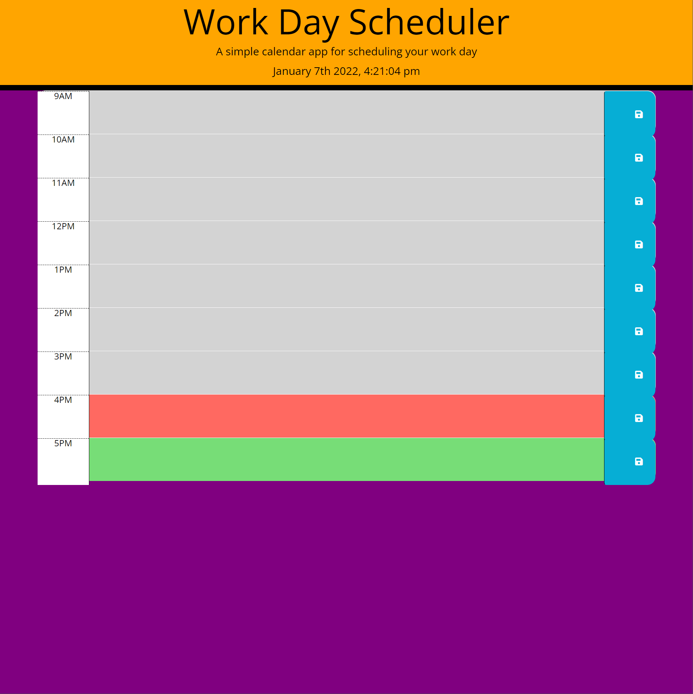

# Work Day Scheduler

## Task

Create a simple calendar application that allows a user to save events for each hour of the day by modifying starter code. This app will run in the browser and feature dynamically updated HTML and CSS powered by jQuery.

## User Story

I used JQUERY along with javascript in order to select classes within the HTML in order to get the desired results. I added and removed classes in order to get the color coded hours using JQUERY. I've also added a current time for when the page is loaded based on the user's time that doesn't refresh. I've also stored the text and hour data in the localstorage based on if they written in any hour and saved it. Also, I've added code to read the localstorage and load the data on the page if there is anything saved on localstorage.

